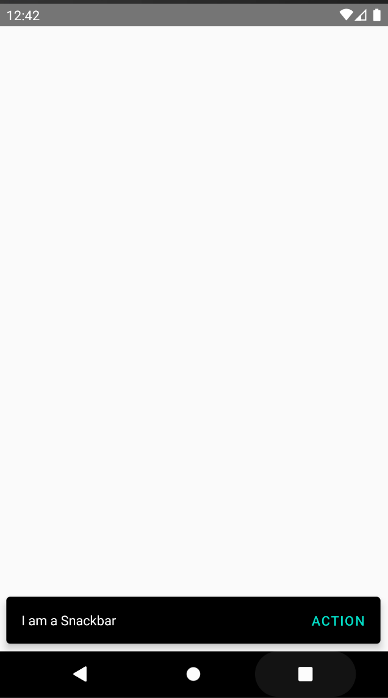

# react-native-paper-snackbar

This is a custom component for React Native, a simple paper snackbar, compatible with ios and android.

## Installation

#### yarn

```
yarn add https://github.com/usmankiani256/react-native-paper-snackbar
```

or

#### npm

```
npm i --save https://github.com/usmankiani256/react-native-paper-snackbar
```

## Usage

```js
import React, { useEffect } from 'react'
import { showSnackbar, Snackbar } from 'react-native-paper-snackbar'

const snackbar = {
  title: 'I am a Snackbar', // Title of the snackbar
  action: {
    label: 'Action', // The label of the button
    onPress: () => console.log('Action was pressed'),
  },
  duration: 7000, // Automatically dismiss the snackbar after provided seconds
}

const App = () => {
  // Call the Snackbar Component on component mount
  useEffect(() => {
    showSnackbar(snackbar)
  }, [])

  // Render the Snackbar Component, recommended to use in initial screen
  return <Snackbar />
}

export default App
```

### PaperSnackbar

The Paper Snackbar component that displays the Snackbar

> :warning: recommended to use in initial screen

### showSnackbar

#### params

| Param    | Type   | Description                                                                                    | Default |
| :------- | :----- | :--------------------------------------------------------------------------------------------- | :------ |
| title    | String | The Title of the paper snackbar component.                                                     |         |
| duration | Number | If number is provided Snackbar will be dismissed after the provided seconds.                   | 30000   |
| action   | Array  | An array of objects passed to the component, the action object passed has the following props: |         |

#### action object

| Param   | Type   | Description             |
| :------ | :----- | :---------------------- |
| label   | String | The label of the button |
| onPress | Func   | The onPress Callback    |

<!--
## Contributing

## Credits -->

## Screenshot



## License

MIT License

Copyright (c) 2021 Muhammad Usman Kiani

Permission is hereby granted, free of charge, to any person obtaining a copy
of this software and associated documentation files (the "Software"), to deal
in the Software without restriction, including without limitation the rights
to use, copy, modify, merge, publish, distribute, sublicense, and/or sell
copies of the Software, and to permit persons to whom the Software is
furnished to do so, subject to the following conditions:

The above copyright notice and this permission notice shall be included in all
copies or substantial portions of the Software.

THE SOFTWARE IS PROVIDED "AS IS", WITHOUT WARRANTY OF ANY KIND, EXPRESS OR
IMPLIED, INCLUDING BUT NOT LIMITED TO THE WARRANTIES OF MERCHANTABILITY,
FITNESS FOR A PARTICULAR PURPOSE AND NONINFRINGEMENT. IN NO EVENT SHALL THE
AUTHORS OR COPYRIGHT HOLDERS BE LIABLE FOR ANY CLAIM, DAMAGES OR OTHER
LIABILITY, WHETHER IN AN ACTION OF CONTRACT, TORT OR OTHERWISE, ARISING FROM,
OUT OF OR IN CONNECTION WITH THE SOFTWARE OR THE USE OR OTHER DEALINGS IN THE
SOFTWARE.
